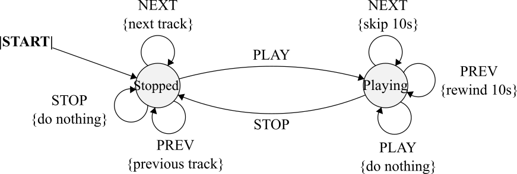

Java Patterns | State
===

**State** is a *behavioral design pattern* that allows an object to change
its behavior depending on its inner state.

It is closely related to the *finite state machine* (FSM) concept.

- *Online resource*: [State Pattern (refactoring guru)](https://refactoring.guru/design-patterns/state)

## Aplication

This repository implements a `MusicPlayer` that provides the following commands (public methods):

- ⏯️ `play()`
- :rewind: `prev()`
- :fast_forward: `next()`
- ⏹️ `stop()`
- :question: `status()`

Its behavior for each command is defined through usage of the **State** pattern (see code) and "implements" the following FSM:

The program provided in the `Main` class gives us a *command-line interface* to interact with a `MusicPlayer` instance.  

Run the program and check that, indeed, it behaves accordingly to the diagram above.

## Exercises

1. 