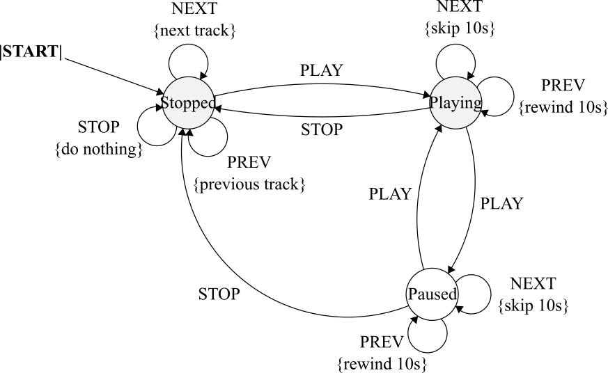

Java Patterns | State
===

**State** is a *behavioral design pattern* that allows an object to change
its behavior depending on its inner state.

It is closely related to the *finite state machine* (FSM) concept.

- *Online resource*: [State Pattern (refactoring guru)](https://refactoring.guru/design-patterns/state)

## Aplication

This repository implements a `MusicPlayer` that provides the following commands (public methods):

- ⏯️ `play()`
- :rewind: `prev()`
- :fast_forward: `next()`
- ⏹️ `stop()`
- :question: `status()`

Its behavior for each command is defined through usage of the **State** pattern (see code) and "implements" the following FSM:

The program provided in the `Main` class gives us a *command-line interface* to interact with a `MusicPlayer` instance.  

Run the program and check that, indeed, it behaves accordingly to the diagram above.

## Exercises

1. Create a new *concrete state* in the class `PausedState` and change the existing ones to achieve the following FSM:

    

    :bulb: There is no need to make changes to the `CLI` class.
    
2. Add `turnOn()` and `turnOff()` methods to `MusicPlayer`. The behavior of these
methods should be delegated to the current *state*. Note that this requires changing
the `MusicPlayerState` *interface*. Create a new `OffState` and make the necessary
changes to implement the following FSM:

    
    
    - :warning: Please note:
    
        - The previous *transition rules* between existing states stay the same; they are ommited from the above diagram;
        
        - The initial state is the `Off`;
        
        - You can only transition from the `Off` with the `TURNON` command; all others are silently ignored.
        
        - All other states silently ignore the `TURNON` command.
        
        - When transitioning from `Off` state to `Stopped` state the player must always load the first song of the *playlist*;
        
        - Whenever a transition is made to `Stopped` state the *playback* must stop and resources freed. 
        
    
Solutions are provided [here](SOLUTION.md).